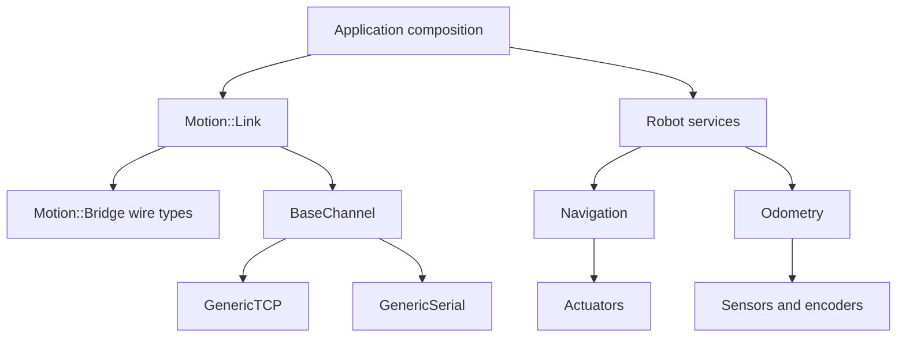
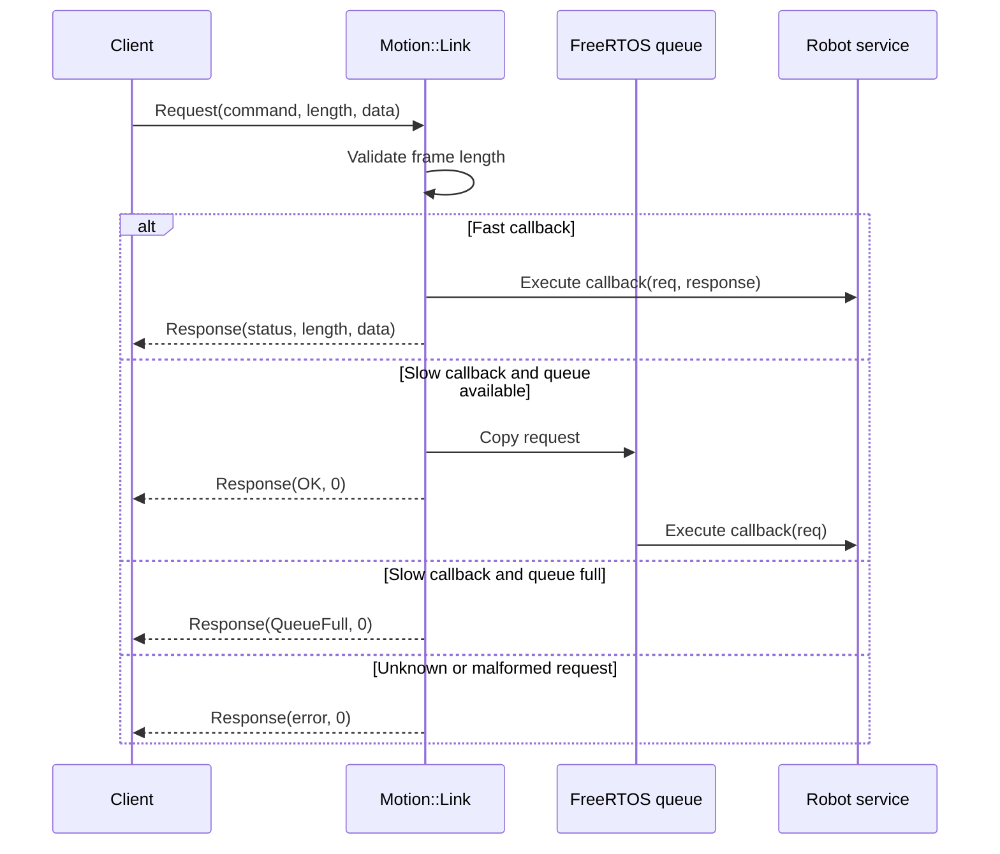

# Architecture

## Layer model

Motion is organized around narrow interfaces. Higher layers depend on contracts rather than hardware implementations.



## Component responsibilities

### Motion Core IO

The IO layer defines interfaces for communication channels, actuators, sensors, and motors. A platform-specific class implements these interfaces. The rest of the framework can then use the interface without knowing whether the device is an ESP32 peripheral, a serial device, or a test double.

`Motion::Link` requires a `BaseChannel` implementation and starts it through either `GenericTCP` or `GenericSerial`. The raw channel API reports available bytes; Link currently expects a complete request per `Read()` call, so production TCP and serial integrations must preserve or reconstruct frame boundaries.

### Motion Core Robot

Robot services own the behavior and state of a robot. Odometry maintains a pose, navigation issues movement operations, and stop conditions decide when a motion should end. These services may run their own FreeRTOS tasks and protect shared state with framework synchronization primitives. Hardware and odometry must be started explicitly; navigation is a composed service and has no separate `Start()` method.

Link does not implement robot behavior. It exposes selected robot services by attaching callback specializations such as:

- `BaseOdometry`: fast `GetPosition` response.
- `BaseNavigation`: slow `MoveTo`, `Orient`, `Move`, and `Turn` commands.
- `GenericDifferentialDriveNavigation`: fast `GetDrive` response plus inherited navigation and odometry callbacks.
- `ExternalStopCondition`: fast `Stop` command when explicitly attached.

### Motion Bridge

`Motion::Bridge` is the protocol vocabulary shared by the embedded target and its client. It defines the command numbers, response statuses, and packed payload structures. It contains no transport or task logic.

### Motion Link

`Motion::Link` is the runtime adapter. It owns one channel, receives requests, validates their declared lengths, dispatches callbacks, and sends responses.

There are two callback paths:

- Fast callbacks execute directly in the receive loop and can populate a response.
- Slow callbacks are copied into an eight-entry FreeRTOS queue and run by a worker task. Their immediate response only reports whether the request was accepted by the queue.

## Runtime sequence



## Startup contract

The application owns composition and startup. A reliable startup sequence is:

```cpp
// 1. Start motors, wheels, and odometry first.
auto navigation = DifferentialDriveNavigation::Create(...);

// 2. Start exactly one transport.
if (!Motion::Link::StartTCP<MyTcpChannel>())
{
    // Report the failure and do not call Spin().
}

// 3. Expose the service and enter the communication task.
Motion::Link::AttachCallbacks(navigation);
Motion::Link::Spin();
```

The concrete channel type must derive from the matching generic channel class and provide the factory expected by `StartTCP<T>()` or `StartSerial<T>()`. Navigation commands are blocking inside the robot service but are dispatched through Link's slow queue when called remotely.

## Threading and ownership

- The application must keep objects captured by callbacks alive while Link is running.
- Fast callbacks share the receive-loop context and should be short, deterministic, and non-blocking.
- Slow callbacks execute on the Link worker task and may perform longer operations, subject to the robot service's own thread-safety contract.
- Robot services remain responsible for protecting their internal state.
- Link does not provide a stop or shutdown API; terminate the task or reset the platform according to the application lifecycle.

## Extension points

Use application command values from `Motion::Bridge::Command::UserCommandStart` onward. Register a fast callback when the operation can complete immediately and needs to return data. Register a slow callback when the operation starts work that should not block the receive loop.

For reusable framework integrations, add a `Link::AttachCallbacks<T>()` specialization near the other Link service adapters and document its command payload contract in the protocol reference.
