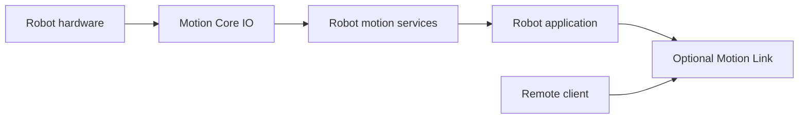

# Motion Robotics Framework

Motion is a modular C++ framework for building embedded robots. It provides the building blocks for connecting hardware, tracking movement, creating motion behaviors, and exposing a robot to remote applications.

The framework is designed to be composed around the needs of each robot. Use the hardware interfaces on their own, assemble a complete motion pipeline, or add Motion Link when the robot needs network or serial control.

## Explore the framework

| Start here | What it covers |
|---|---|
| [Getting started](getting-started.md) | First project setup and robot composition |
| [Architecture](architecture.md) | How the framework components fit together |
| [Core concepts](core-concepts.md) | Ownership, lifecycle, concurrency, and units |
| [IO reference](io-reference.md) | Communication, sensors, actuators, logging, and wheels |
| [Motion pipeline](motion-pipeline.md) | Odometry, controllers, profiles, stop conditions, and navigation |
| [Motion Link protocol](protocol.md) | Remote communication and message definitions |
| [Examples and templates](examples.md) | Ready-to-adapt application examples |

## Framework at a glance

### Motion Core IO

Interfaces for communication channels, sensors, actuators, motors, encoders, and logging.

### Motion Core Robot

Reusable services for wheel conversion, odometry, controllers, motion profiles, stop conditions, and navigation.

### Motion Link

An optional communication layer for connecting a robot to a remote client over TCP or serial.

## API reference

- [Link API](_link_8h.html)
- [Bridge types](_link_type_def_8h.html)

The complete API is available through the generated class, namespace, and file indexes.

## Examples

- [Complete differential-drive template](CompleteDifferentialDriveMotionLink.cpp)
- [TCP server template](MotionLinkTcpTemplate.cpp)
- [Serial server template](MotionLinkSerialTemplate.cpp)
- [Custom command template](MotionLinkCustomCommandTemplate.cpp)
