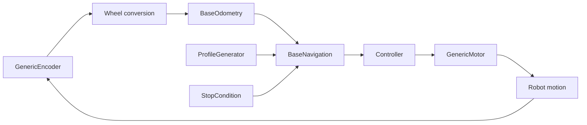

# Motion Pipeline

The robot motion stack turns sensor measurements into actuator commands through a sequence of replaceable services.



## Wheel and odometry

`Wheel` converts encoder counts to distance and speed. `BaseOdometry` owns the periodic FreeRTOS update task and exposes a thread-safe `Position` snapshot. `GenericDifferentialDriveOdometry` adds left/right wheel state, while `DifferentialDriveOdometry` supplies the concrete differential-drive kinematics.

Start wheels before odometry:

```cpp
rightWheel->Start();
leftWheel->Start();
odometry->Start(1000);
```

The odometry frequency is in hertz and is constrained by the implementation's FreeRTOS timing model. Use a frequency appropriate for the board's CPU budget.

## Controllers

`BaseController` defines reset and command-generation behavior. `PIDController` adds proportional, integral, and derivative terms with output limits.

Use one controller per independently controlled actuator and tune gains in the same command and measurement units used by the motor layer:

```cpp
auto rightController = PIDController::Create(
    {0.004f, 0.0f, 0.0003f}, 1.0f, -1.0f);
```

Reset controller state between independent motion sessions when the controller contract requires it.

## Profiles

`BaseProfileGenerator` defines the profile interface. `StepProfileGenerator` produces a constant command. `TrapezoidalProfileGenerator` limits acceleration and velocity and may produce triangular profiles for short moves.

Name the limits in the application configuration and keep them in the same units as navigation:

```cpp
constexpr float MaximumAcceleration = 300.0f;
constexpr float MaximumVelocity = 500.0f;
constexpr float MinimumVelocity = 30.0f;

auto profile = TrapezoidalProfileGenerator::Create(
    MaximumAcceleration, MaximumVelocity, MinimumVelocity);
```

## Stop conditions

`BaseStopCondition` defines `ShouldExit(error)` and `Reset()`. Available strategies include:

- `ToleranceStopCondition`: exits when absolute error is within a threshold.
- `SettleStopCondition`: requires the error to remain within tolerance for a duration in milliseconds.
- `OscillationStopCondition`: exits after a configured number of error sign changes.
- `ExternalStopCondition`: exits when an external flag is asserted.
- `AndStopCondition` and `ORStopCondition`: compose conditions with logical AND or OR behavior.

```cpp
auto settle = SettleStopCondition::Create(5.0f, 1);
auto oscillation = OscillationStopCondition::Create(3);
auto stopCondition = settle || oscillation;
```

Name time units explicitly. For example, the `1` above is one millisecond, not one second.

## Navigation

`BaseNavigation` exposes blocking movement operations such as `Move`, `Turn`, `MoveTo`, and `Orient`. `GenericDifferentialDriveNavigation` composes odometry and wheel control dependencies. `DifferentialDriveNavigation` provides the concrete factory for a differential-drive robot.

Navigation has no separate `Start()` method. Start its dependencies first, then create navigation and issue commands:

```cpp
auto navigation = DifferentialDriveNavigation::Create(
    odometry,
    profile,
    stopCondition,
    {rightMotor, leftMotor, rightController, leftController});

navigation->Move(100.0f);
```

When called through Motion Link, these operations run through slow callbacks: the client receives queue acceptance before the blocking navigation operation completes.

## Safety and completion

Remote command acknowledgement is not a safety signal or motion-complete signal. Use local stop conditions, motor limits, watchdogs, and an independent physical or application-level emergency stop. If a remote client needs completion events, define an application command or telemetry channel rather than treating queue acceptance as completion.
